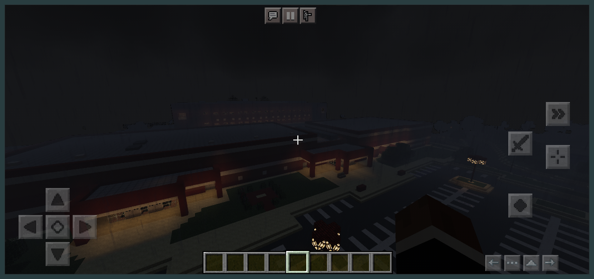

# Eagler Pocket Mobile v1.40
 A revamp of FlamedDogo99's eaglercraft mobile UI using pocked edition UI.<br>
 Now currently just a reskin with different positions!


<br>

<hr>

 ## Versions
   __v1.40__ - Updated to the most modern version from FlamedDogo.<br>
  __v1.31__ - Added offline file (code update in the future).<br>
 __v1.30__ - Condensed code into one file and updated to match original.<br>

 [eaglercraft.com](https://eaglercraft.com) is using __v1.31__

 <hr>

## Installation
 Just add following code into `index.html` file of your eaglercraft!<br>

 ```javascript
<script type="text/javascript" src="eaglerpocketmobile.user.js"></script>
 ```
 
 _A demo of the code can be seen in the [Demo's folder](https://github.com/irv77/EaglerPocketMobile/tree/main/demo/)_<br>
 _Or play the offline version in the [Offline file!](https://github.com/irv77/EaglerPocketMobile/blob/main/EaglercraftX_1.8_u35_Offline_Signed.html)_

<hr>

## Features added

<details>
<summary>Click here to expand feature list</summary>

- [x] Strafe buttons when holding forward
- [x] Crouch lock on hold
- [x] Sprint button (sperate from double tapping forward)
- [ ] Misc Platform support (Controller, Keyboard arrows, etc)
- [x] Cancel button for file upload
- [x] Styling for file upload
- [x] Back button for Kiwi browser?
- [x] Re-orginize button layout (With new icons)
- [x] Redo the display button functions
- [x] Pocket Edition UI
- [x] Updated code from main
- [x] Bug fixes from original
- [ ] Config file for features
- [x] Organized Code
</details>

<hr>

>__Finally [here](https://irv77.github.io/EaglerPocketMobile/demo/) is the live version of the code!__